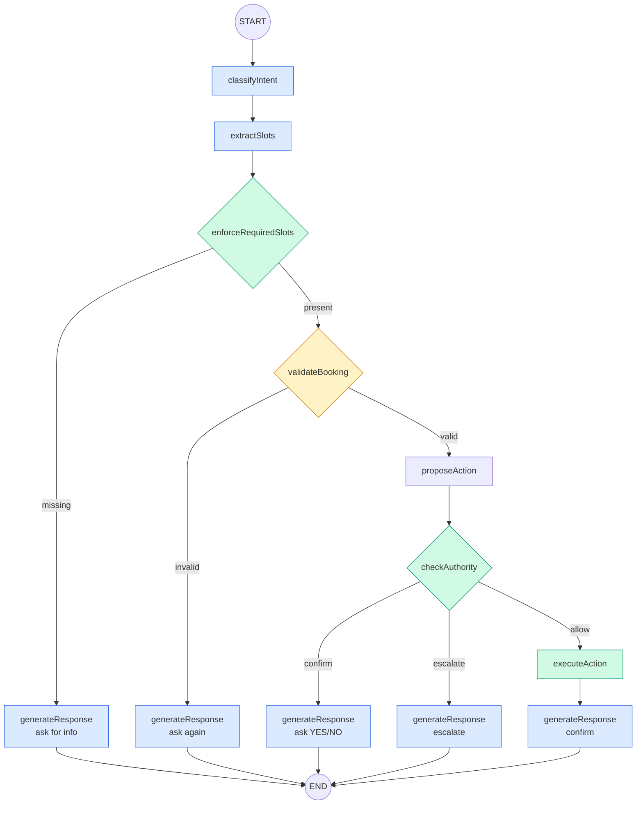

# AeroAssist — Detailed Project Description & Working Flow

## Use this document to generate a PowerPoint presentation.

---

## Slide 1: Title Slide

**Title:** AeroAssist — AI-Powered Airline Disruption Support Agent

**Subtitle:** Intelligent Customer Service Automation for Airlines

**Tags:** LangGraph.js · Groq LLM · PostgreSQL · Next.js 14 · TypeScript

**Date:** September 2026

---

## Slide 2: Problem Statement

Airlines face high volumes of customer complaints during disruptions (cancellations, delays, fare issues). Manual handling is slow, inconsistent, and expensive.

**Challenges:**
- Customers wait hours for support during mass disruptions
- Agents apply policies inconsistently
- No real-time tracking of complaint resolution
- Escalation paths are unclear
- Each customer interaction starts from scratch

**Solution:** An AI agent that handles the full lifecycle — from greeting to resolution — following exact airline policies, with a complete audit trail.

---

## Slide 3: Project Overview

AeroAssist is an autonomous AI customer service agent that:

1. **Classifies** the customer's issue (cancellation, delay, refund, fare difference)
2. **Extracts** relevant details (name, PNR, flight number)
3. **Validates** the booking against the airline's database
4. **Proposes** the correct action based on airline policies
5. **Executes** the action with proper authorization checks
6. **Responds** with a natural-language confirmation

The agent is **stateless** — it has zero customer data and must always ask for identification before helping. This simulates a real customer service scenario.

---

## Slide 4: Tech Stack

| Layer | Technology | Purpose |
|-------|-----------|---------|
| Frontend | Next.js 14 (App Router), React 18, Tailwind CSS | Chat UI + Admin Dashboard |
| Agent Orchestration | LangGraph.js (v1.4.15) | State machine for agent workflow |
| LLM Provider | Groq Free Tier (`qwen/qwen3.8-27b`) | Intent classification, slot extraction, response generation |
| Structured Output | Zod v4 | Schema validation for LLM outputs |
| Database | PostgreSQL 16 (Docker) | Customer data, bookings, conversation logs |
| ORM | Prisma 6.19 | Database queries and migrations |
| Streaming | Vercel AI SDK v7 | Real-time SSE streaming from agent to browser |
| Observability | LangSmith | Execution traces, latency monitoring |
| Testing | Vitest 4 | Unit tests for schemas and authority rules |
| Language | TypeScript 5 (strict mode) | Type safety across the codebase |

---

## Slide 5: System Architecture — High Level

```
┌─────────────┐     ┌──────────────┐     ┌─────────────────┐     ┌──────────────┐
│   Browser    │────▶│  API Layer   │────▶│   Agent Core    │────▶│   External   │
│  (React UI)  │◀────│ (Next.js)    │◀────│  (LangGraph)    │◀────│  Services    │
└─────────────┘     └──────────────┘     └─────────────────┘     └──────────────┘
  Chat UI            POST /api/chat        8-node state machine    Groq (LLM)
  Admin View         GET /api/events       3 LLM calls/turn        PostgreSQL
  SSE Stream         Event recording       5 pure code nodes       LangSmith
```

**Data Flow:**
- Browser sends messages via SSE (Server-Sent Events)
- API layer invokes the agent graph and records events to PostgreSQL
- Agent core runs through a fixed pipeline of nodes
- External services: Groq for LLM inference, PostgreSQL for data, LangSmith for traces

---

## Slide 6: Agent Graph — The 8-Node Pipeline

The agent is built as a LangGraph StateGraph — a directed graph where each node is either an LLM call or pure code logic.

**Nodes:**

| # | Node | Type | Purpose |
|---|------|------|---------|
| 1 | classifyIntent | LLM | Classifies intent (cancellation/delay/refund/fare_difference/general_inquiry) + sentiment score |
| 2 | extractSlots | LLM | Extracts structured data (name, PNR, flight, reason) from conversation |
| 3 | enforceRequiredSlots | Deterministic | Strips hallucinated values — checks if slot values appear in user messages |
| 4 | validateBooking | Prisma/DB | Looks up PNR in database, verifies customer name matches |
| 5 | proposeAction | LLM | Proposes the correct action based on policies + booking data |
| 6 | checkAuthority | Pure Code | Evaluates action against authority rules (allow/confirm/escalate) |
| 7 | executeAction | Pure Code | Mock-executes the action (refund, rebook, voucher) |
| 8 | generateResponse | LLM | Produces the final natural-language response |

---

## Slide 7: Graph Flow — Decision Points

```
START
  │
  ▼
classifyIntent ──▶ extractSlots ──▶ enforceRequiredSlots
                                          │
                                   missingSlots > 0?
                                   ┌───────┴───────┐
                                   │ YES           │ NO
                                   ▼               ▼
                             generateResponse   validateBooking
                             (ask for info)         │
                                   │           PNR valid?
                                   ▼         ┌────┴────┐
                                 END         │ NO      │ YES
                                             ▼         ▼
                                       generateResponse  proposeAction
                                       (ask again)           │
                                             │          checkAuthority
                                             ▼         ┌────┼────────┐
                                           END     allow  confirm  escalate
                                                    │       │        │
                                                    ▼       ▼        ▼
                                              execute  generate  generate
                                              Action   Response  Response
                                                │
                                                ▼
                                           generateResponse
                                           (confirm action)
                                                │
                                                ▼
                                               END
```

**Key Design Decision:** The `enforceRequiredSlots` node ensures the agent never acts on hallucinated data. If the LLM invents a PNR or name, this deterministic node strips it and forces the agent to ask again.

---

## Slide 8: Slot Extraction & Validation

**Slot Schema (per intent):**

| Intent | Required Slots | Optional Slots |
|--------|---------------|----------------|
| cancellation | customerName, pnr | flightNumber, origin, destination, reason |
| delay | customerName, pnr, reason | flightNumber, origin, destination, currentDelayMinutes |
| refund | customerName, pnr, reason | flightNumber, refundType, amount, feedback |
| fare_difference | customerName, pnr | newFlightNumber, fareDifference |
| general_inquiry | customerName, pnr | topic, question |

**Why `reason` is required for delays:** After validating the booking, the agent must ask "How can I help you?" before proposing actions. Without `reason`, the agent would jump straight to "Would you like me to proceed?" which is poor UX.

**Enforcement Flow:**
1. LLM extracts slots (may hallucinate values)
2. `enforceRequiredSlots` checks each value against actual user messages
3. Values not found in user messages are stripped
4. Missing required slots are added to `missingSlots`
5. Agent asks for the missing information

---

## Slide 9: Database Validation

**Flow:**
1. Customer provides PNR (e.g., "TR1190B")
2. Agent looks up PNR in PostgreSQL via Prisma
3. If PNR not found → clear it, ask again
4. If PNR found → verify customer name matches booking owner
5. If name doesn't match → clear both, ask again
6. If multiple flights under same PNR → ask which flight

**One PNR, Multiple Segments:**
- Priya Nair's PNR "SK4821X" covers both Delhi→Goa (cancelled) and Goa→Delhi (on_time)
- Agent asks which flight she needs help with

**Enriched Slots:**
After validation, slots are enriched with real database data:
- `flightNumber`, `origin`, `destination`, `fareClass`, `bookingStatus`
- `_validatedBookingId`, `_validatedCustomerId` (internal tracking)

---

## Slide 10: Authority Rules — Decision Engine

A data-driven rule table (pure code, no LLM) determines what the agent can do:

| Action | Condition | Result | Reason |
|--------|-----------|--------|--------|
| rebook_flight | fareDifference = 0 | ALLOW | Airline-caused: free rebooking within 24h |
| rebook_flight | fareDifference ≤ ₹1,500 | CONFIRM | Ask customer first |
| rebook_flight | fareDifference > ₹1,500 | ESCALATE | Needs supervisor |
| process_refund | airline-caused | ALLOW | Full refund within 7 days |
| issue_voucher | amount ≤ ₹500 | ALLOW | Meal voucher per delay policy |
| issue_voucher | amount > ₹500 | CONFIRM | Ask customer first |
| issue_lounge_access | delay > 3h | ALLOW | Per delay compensation rule |
| arrange_hotel | delay > 5h | ALLOW | Delayed hours only, not full night |
| escalate_to_agent | legal/complaint | ESCALATE | Always escalate |

**Three Outcomes:**
- **ALLOW** → Execute immediately, log action
- **CONFIRM** → Present action, ask YES/NO, wait for confirmation
- **ESCALATE** → Transfer to human agent, log escalation

---

## Slide 11: Service Policies (Exact Assignment Rules)

**Cancellation Rebooking Rule:**
- If flight cancelled by airline → free rebooking on next available flight within 24h
- OR full refund — customer's choice

**Delay Compensation Rule:**
- Under 3 hours → ₹500 meal voucher
- More than 3 hours → meal voucher + lounge access
- More than 5 hours → meal voucher + hotel accommodation (delayed hours only, NOT full night)

**Refund Processing Rule:**
- Full refund within 7 business days
- Original payment method only

**Fare Difference Rule:**
- Agent cannot waive fare differences above ₹1,500 without supervisor approval

**Loyalty Tier Rule:**
- Gold/Platinum get priority rebooking (first access to next-available seats)
- No additional compensation beyond standard policy

---

## Slide 12: Prompt Registry — Centralized Prompt Management

**Problem:** Prompt strings were scattered across 5 files, copy-pasted in 4 places. Every bug fix meant editing inline string literals inside node functions.

**Solution:** All prompts centralized in `lib/agent-core/prompts/index.ts`

**Architecture:**
- Each node imports its prompt function from the registry
- Shared constant: `NO_CUSTOMER_DATA` — tells the LLM it has zero customer info
- `selectResponsePrompt(state)` — routes to the correct response mode based on graph state

**Functions:**
- `classifyIntentPrompt()` — Intent + sentiment classification
- `extractSlotsPrompt(intent, required, filled)` — Structured slot extraction
- `proposeActionPrompt(state)` — Action proposal with policies injected
- `infoGatheringPrompt(state)` — Asks for missing information
- `confirmationPrompt(state)` — Presents action, asks YES/NO
- `escalationPrompt(state)` — Informs about human transfer
- `resolutionPrompt(state)` — Confirms completed action, asks for feedback
- `generalResponsePrompt()` — Fallback for general inquiries

**Benefits:**
- Edit one prompt → propagates to all nodes
- "You have no customer data" instruction in one constant
- Easy to test prompts in isolation

---

## Slide 13: Stateless Chat Design

**Key Design Decision:** The chatbot has ZERO customer data.

**Why:**
- Simulates a real customer service scenario
- Agent must always ask for identification (name + PNR)
- No "signed in" assumptions
- Forces proper validation flow

**Implementation:**
- API route uses a fallback customer ID for the database foreign key (required by Prisma schema)
- Agent graph state never receives customer data
- All LLM prompts explicitly state: "You have NO access to any customer database"
- Agent must ask for name + PNR before providing any information

**Flow:**
1. User says "hi" → Agent asks for name + PNR
2. User provides details → Agent validates against database
3. If valid → Agent asks "How can I help you?"
4. User states request → Agent proposes action
5. User confirms → Agent executes

---

## Slide 14: Conversation Flow — Real Example

**Scenario:** Arvind Kulkarni's flight SK-118 (Mumbai→Bengaluru) is delayed 4 hours

```
User: "My flight is delayed"
Agent: "Could you please provide your full name and your booking reference (PNR number)?"
       [classifyIntent: delay | extractSlots: missing customerName, pnr, reason]

User: "My name is Arvind Kulkarni and my PNR is TR1190B"
Agent: [validateBooking: finds SK-118 BOM→BLR, delayed]
       "How can I help you with this? (rebooking, compensation, meal voucher, hotel...)"
       [missingSlots: reason]

User: "I want compensation for the delay"
Agent: "Based on your booking and our policies, I can issue a ₹500 meal voucher.
        Would you like me to proceed? Please confirm with YES or NO."
       [proposeAction: issue_voucher ₹500 | checkAuthority: allow]

User: "Yes"
Agent: "Done! A ₹500 meal voucher has been issued to your account.
        Is there anything else we could have done better, or any other way I can help?"
       [executeAction: completed | generateResponse: confirmation]
```

---

## Slide 15: Admin Audit View

**Conversation List (`/admin`):**
- Table of all conversations with ID, customer name, loyalty tier, status badge, event count
- Status badges: active (green), resolved (blue), escalated (red)
- Click to view detailed timeline

**Event Timeline (`/admin/[conversationId]`):**
- Vertical timeline with color-coded dots:
  - Blue = message
  - Purple = slot extracted
  - Yellow = action proposed
  - Green = action executed
  - Red = escalated
- Full event payload display
- Customer info header

**Every interaction is logged:**
- User messages
- Intent classification results
- Slot extraction results
- Proposed actions
- Executed actions
- Escalation reasons

---

## Slide 16: Seeded Data — Assignment Scenarios

| Customer | Tier | PNR | Flight | Route | Status | Scenario |
|----------|------|-----|--------|-------|--------|----------|
| Priya Nair | Gold | SK4821X | SK-204 | DEL → GOI | Cancelled | Wants full refund + business class upgrade |
| Priya Nair | Gold | SK4821X | SK-204R | GOI → DEL | On-time | Return flight unaffected |
| Arvind Kulkarni | Silver | TR1190B | SK-118 | BOM → BLR | Delayed 4h | Wants hotel accommodation |
| Meher Kaur | Platinum | WL7742 | SK-305 | DEL → HYD | Delayed 6h | Wants full night hotel + higher-fare flight (₹2,000 diff) |

**Three test scenarios cover:**
1. Cancellation → refund flow
2. Delay (3-5h) → meal voucher + lounge access
3. Delay (>5h) → hotel + fare difference escalation

---

## Slide 17: Testing & Quality

**Unit Tests (33 tests):**

| Test File | Tests | Coverage |
|-----------|-------|----------|
| authority-rules.test.ts | 12 | All action types, threshold boundaries, edge cases |
| intent-slots.test.ts | 21 | All 5 intent schemas, required/optional fields, rejection |

**What's Tested:**
- Authority rule table: refund thresholds, voucher limits, escalation paths
- Slot schemas: required fields always enforced, optional fields correctly handled
- Schema rejection: invalid data properly rejected

**What's NOT Tested (known gaps):**
- Node behavior (LLM calls) — no integration tests
- Graph flow end-to-end — requires live API key
- Frontend components — no React tests

---

## Slide 18: Observability — LangSmith Integration

**Setup:**
- Set `LANGCHAIN_TRACING_V2=true` in `.env`
- Add LangSmith API key
- All graph executions automatically traced

**What You See in LangSmith:**
- Node-by-node execution timeline
- LLM inputs/outputs at each step
- Latency per node (identify bottlenecks)
- Metadata tags (conversationId, customerId)
- Full prompt text including injected policies

**Benefits:**
- Debug which node failed
- See exactly what the LLM received and returned
- Monitor token usage and costs
- Track conversation flow across turns

---

## Slide 19: Project Structure

```
aeroassist/
├── app/                          # Next.js App Router
│   ├── api/chat/route.ts         # POST — invoke agent, stream response
│   ├── api/conversations/        # GET — event log for conversations
│   ├── chat/page.tsx             # Chat UI with SSE streaming
│   └── admin/                    # Admin dashboard
├── lib/
│   └── agent-core/
│       ├── graph.ts              # LangGraph StateGraph (8 nodes)
│       ├── state.ts              # Graph state definition
│       ├── prompts/index.ts      # Centralized prompt registry
│       ├── authority-rules.ts    # Decision engine (pure code)
│       ├── policies.ts           # Airline service rules
│       ├── nodes/                # 8 graph node implementations
│       ├── schemas/              # Zod schemas for LLM output
│       └── __tests__/            # Unit tests (33 tests)
├── prisma/
│   ├── schema.prisma             # Database schema
│   └── seed.ts                   # Assignment data
├── docker-compose.yml            # PostgreSQL container
└── package.json                  # Dependencies + scripts
```

---

## Slide 20: Key Commands

| Command | Description |
|---------|-------------|
| `docker compose up -d` | Start PostgreSQL |
| `npm install` | Install dependencies |
| `npx prisma db push --force-reset` | Reset database |
| `npx prisma db seed` | Seed with assignment data |
| `npm run dev` | Start dev server (port 3000) |
| `npm run test` | Run 33 unit tests |
| `npm run lint` | Run ESLint |
| `npx prisma db studio` | Open database viewer |

---

## Slide 21: Architecture Diagram — Mermaid Format



---

## Slide 22: Key Takeaways

1. **Structured Pipeline** — Not a free-form chatbot. Fixed 8-node graph ensures consistent behavior.
2. **Hallucination Prevention** — Deterministic `enforceRequiredSlots` node strips invented values.
3. **Database Validation** — PNR verified against real bookings before any action.
4. **Policy Compliance** — Exact assignment rules injected into LLM context.
5. **Authority Engine** — Pure code rule table decides allow/confirm/escalate.
6. **Full Audit Trail** — Every interaction logged for compliance.
7. **Stateless Design** — Agent has zero customer data, forces proper identification flow.
8. **Prompt Centralization** — All prompts in one module, edit once propagate everywhere.

---

## Slide 23: Limitations & Future Work

**Current Limitations:**
- LLM-based chatbot, not a true autonomous agent (fixed graph, no dynamic tool selection)
- Actions are mock-executed (no real airline API integration)
- Single-turn slot filling (no persistent slot accumulation across turns)
- No authentication on admin view

**Future Improvements:**
- ReAct-style agent with dynamic tool calling
- Real airline API integration (refund processing, rebooking)
- Multi-turn slot filling with persistent state
- Authentication and multi-tenancy
- RAG for policy documents
- Real-time flight status API integration

---

## Slide 24: Thank You

**AeroAssist** — AI-Powered Airline Disruption Support Agent

Built with: Next.js 14 · LangGraph.js · Groq · PostgreSQL · TypeScript

33 Tests Passing · ESLint Clean · Full Audit Trail
